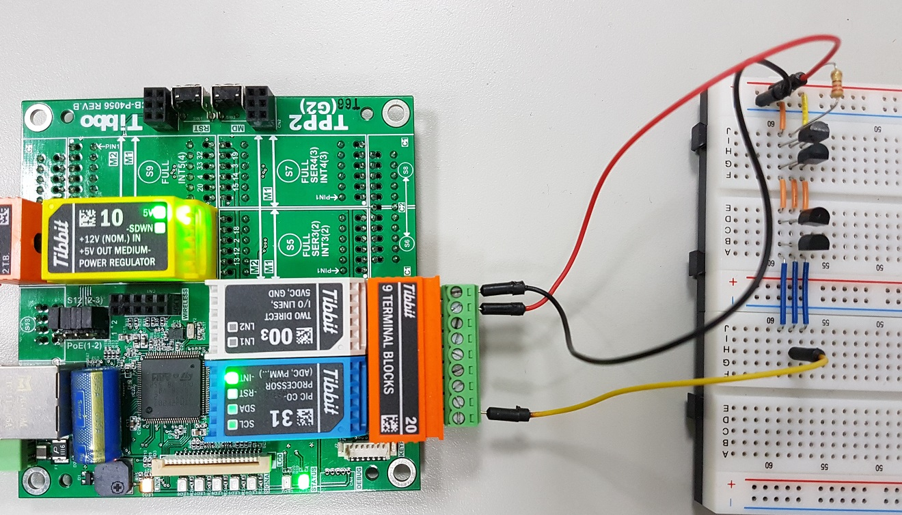
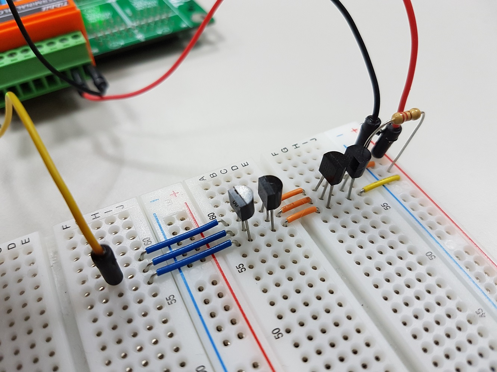
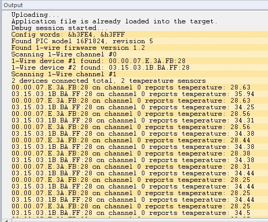

# CA-One_Wire

This demo project was designed to discover and poll widely used DS18B20 digital thermometers, manufactured by Maxim Integrated and other single-wire temperature / humidity sensors such as DHT11, DHT22, etc. The included 1-wire library is intended to be used as a transparent bridge between PIC Tibbit (#31) and 1-wire bus.

The library contains a PIC firmware which must be uploaded to the PIC memory to correctly operate as a 1-wire decoder.

Basic knowledge of 1-wire protocol internals and electrical characteristics is strongly recommended. You can navigate to <https://www.maximintegrated.com/en/app-notes/index.mvp/id/1796> to learn more.

You will need:

- TPP2, TPP2(G2), TPP3, or TPP3(G2) board
- One Tibbit #31 (PIC processor)
- One Tibbit #20 (9 pin Terminal Block)
- Optionally, one Tibbit #00-3 (5V and Ground)
- Optionally, one Tibbit #9 or #10 (12V->5V regulator)
- Optionally, one Tibbit #18 (power jack)

This layout is very handy when you plan to power sensors from the internal power source. Tibbit #20 allows you to take both +5VDC and Ground right near the 1-wire bus contacts.

Pins on the Tibbit #20 counted from left to right. Pins 1, 2 and 3 are three independent 1-wire / single-wire channels, pins 5 and 9 is a system ground, and pin 8 is +5VDC. Pins 6 and 7 is direct I/O lines which are not used in this application.

Depending on how many of sensors you plan to connect to the bus, you may need to install pull-up resistor (120 Ohm) between +5VDC and signal wire, but for about of 8-10 sensors, this step is not necessary.

There are separate components inside of this application:

- 1-wire.tbs/1-wire.tbh contains 1-wire related functions and procedures. Add this files to your project; this is an essential component of the library.
- PIC_LVP.tbs/PIC_LVP.tbh are complementary files, containing functions and procedures which are used to aid in uploading firmware into the PIC Tibbit memory. Firmware uploading must be done once; after which the firmware will reside in the PIC program memory, even if the power is switched off. The firmware upgrade can be initiated by pressing the "MD" button on the TPS; and this action can be performed at any time when the application is running. Also, this source file contains utility functions to help detection of the PIC Tibbit presence in the specified slot and determining which model it is and which version of firmware it runs.
- i2c_1wire_bridge.hex is a compiled firmware code. If you interested in the firmware source code itself, look into the "fw" subdirectory for the file i2c_1wire_bridge.asm". You will need MicroChip's MPLAB X IDE to compile this file.

If you do not plan to support firmware uploading in your project, you can remove PIC_LVP.tbs, PIC_LVP.tbh, and firmware hex file from your project.

Depending on the type of sensor connected, different readouts will be printed during runtime. Printing is done with sys.debugprint. Therefore, you must run this program in the debug mode.

  

  

  